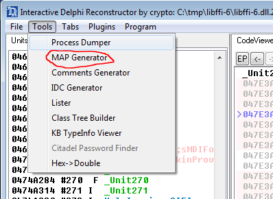

# Butcher
A binary deconstructor
## What is Butcher?
Butcher is a decompiler but also a binary deconstructor, a tool to extract useful code from compiled programs to recompile it in a new tools.
# Tutorial

## Butchering the **GetSecret** function.

Let's start with an easy example:
1. Clone this project, compile it and move to the tutorial directory:

```bash
sudo apt install git build-essential cmake libcapstone-dev libjsoncpp-dev unzip
git clone https://github.com/redsnk/butcher
cd butcher/
cmake CMakeLists.txt
make
cd tutorial
```
2. Unzip the sample:

> zip protected with the password "*infected*"

```bash
unzip -P infected libffi-6.zip
```

> *libffi-6.dll* contains a malware called *Grandoreiro*, a tipical Brasilian RAT compiled with **Delphi**

If we examine this malware with [IDR](https://github.com/crypto2011/IDR) we can identify two functions used to decrypt hidden strings:


| Address  | Name | Function | Parameters |
| ------------- | ------------- | ------------- | ------------- |
| **047E3AE9** | **GetSecret1** | Retrieve encrypted string | **eax** = number of secret, **edx** = secret string  |
| **047E3AF4** | **Decrypt**    | Decrypts the string | **eax** = encrypted string, **edx** = decrypted string |

Now we are going to clone the **GetSecret1** function.

The **GetSecret1** starts at **044FCB68**:


3. Extract de **GetSecret** function from the malware:

```bash
../Butcher -lc -a -m -e0x40b830 "libffi-6.dll" "0x044FCB68" > secret.c
```

> -lc 
>> C source code.

> -a
>> Include the original assembler code as commented lines.

> -m
>> Load the memory from the original file.

> -e0x40b830
>> Exclude the address 0x40b830 from the analisis, this address is used to create an internal Delphi string that is no necessary in this case.

4. Modify the **main** function at **secret.c** below the "*Insert code here ...*" lines with new code:

```C
int main (int argc, char **argv) {
struct _cpu c,*cpu;

    [ ... ]
    _rsp = 0x1b800;
    _rbp = _rsp;
    /* Insert code here ... */
    if (argc > 1) {
        _eax = atoi(argv[1]);
    }
    /* .................... */
    func_0x44fcb68(cpu,0);
    /* Insert code here ... */
    print_unicode_ptr(cpu,_edx);
    /* .................... */
    end(cpu);
    return (0);
}
```

5. Compile the new tool:

```bash
gcc -I../src/emu/ ../src/emu/butcher_x64.c secret.c -o secret
```

6. Execute the new tool:

```bash
./secret 5
```
Now we have the secret with index number 5:

> MkIzMjk1QzMwQzRBRjkxNQ==

7. Let's try with **Python**:

> *** **Warning, this version only works with Python 3.7, install Python 3.7 if you don't have it** ***

```bash
#
# If you don't have Python 3.7 install it
#

sudo apt install libssl-dev libffi-dev zlib1g-dev
wget https://www.python.org/ftp/python/3.7.17/Python-3.7.17.tgz
tar zxf Python-3.7.17.tgz
cd Python-3.7.17/
./configure --prefix=/usr/local
make
sudo make install
cd ..

```
Extract de **GetSecret** function from the malware but as Python source code now:

```bash
../Butcher -lp -a -m -e0x40b830 "libffi-6.dll" "0x044FCB68" > secret.py
```

> -lp
>> Python source code.

8. Modify the **main** function at **secret.py**:

```Python
def main():
    [ ... ]
    cpu._rsp = 0x1b800
    cpu._rbp = cpu._rsp
    # Insert code here ...
    import sys
    if len(sys.argv) > 1:
        cpu._eax = int(sys.argv[1])
    # ...
    func_0x44fcb68(cpu,0)
    # Insert code here ...
    cpu.print_unicode_ptr(cpu._edx)
    # ...
    return 0

if __name__=="__main__":
    sys.exit(main())
```

9. Execute the new **Python** tool:

```bash
sudo pip3.7 install goto-statement
ln -s ../src/emu/butcher_x64.py .
python3.7 secret.py 5
```

The same output but with Python source code:

> MkIzMjk1QzMwQzRBRjkxNQ==

## Butchering the **Decrypt** function.

Let's continue with a more complicated example.

Inside the **Decrypt** function we identify two phases, **Base64 decoding** at **044FCB2A** and **DecryptDecoded** at **044FCB37**.


10. We are going to extract the **DecryptDecoded** function:


First of all we are going to add more symbols to the generated code, [IDR](https://github.com/crypto2011/IDR) contains an option to extract a map of symbols:



The file is called **libffi-6.map** and is included in the tutorial folder, execute this command to convert this map to a list of addresses/names:

```bash
python3.7 ../src/tools/idrmap_to_butcher.py libffi-6.map > libffi-6.txt

```
**libfii-6.txt** now contains a list of named functions:

```bash
head libffi-6.txt

0x4052b8,System_kernel32_CloseHandle
0x4052c0,System_kernel32_GetStdHandle
0x4052c8,System_kernel32_CreateFileW
0x4052d0,System_kernel32_GetFileSize
0x4052d8,System_kernel32_GetFileType
0x4052e0,System_kernel32_ReadFile
0x4052e8,System_kernel32_SetEndOfFile
0x4052f0,System_kernel32_SetFilePointer
0x4052f8,System_kernel32_WriteFile
0x405300,System_kernel32_CreateDirectoryW

```
Let's extract the code:

```bash
../Butcher -lc -a -m -n"libffi-6.txt" "libffi-6.dll" "0x044FC7AC" > decrypt.c
```

> -n"libffi-6.txt"
>> **libffi-6.txt** it's the list of named functions generated previosly.


Now we must patch some code inside the newly generated **decrypt.c**.

11. Delphi has his own memory manager initialzed at the start of the program, because we have skipped it, we must patch this functions with **butcher** memory functions:

| Delphi function |
| ------------- |
| **System__GetMem** |
| **System_AllocMem** |
| **System__FreeMem** |
| **System__ReallocMem** |

Also **decrypt.c** uses some other **imported** functions that we must fill with our code:

| System function |
| ------------- |
| **CharLowerBuffW** |
| **CharUpperBuffW** |

Fortunately, I have included a small script that patches all these functions:

```bash
bash ../src/sed/c/32/patch.sh decrypt.c

```

Now we have the code patched:

```C
void System__GetMem(struct _cpu *cpu,uint64_t raddr) {
    _eax = alloc_mem(cpu,_eax);
    return;
    [ ... ]
```

12. Finally, we must patch de **main** function to accept one string and print the result:

First af all, we save the original **decrypt.c** for future use in this tutorial:

```bash
cp decrypt.c decrypt.old.c
```
And then, patch the file **decrypt.c**:

```C
int main (int argc, char **argv) {
struct _cpu c,*cpu;

    cpu = &c;
    init(cpu);

    [ ... ]
    
    _rsp = 0x1b800;
    _rbp = _rsp;
    /* Insert code here ... */
    char *secret = argv[1];
    // Alloc delphi strings with 8 bytes header (4 bytes - counter + 4 bytes - length)
    _edx = alloc_delphi_ustr(cpu,secret);
    _esp += 0xfffffff4;
    // (_ebp-0x0c) recieves the new unicode strings
    _ecx = _ebp-0x0c;
    /* .............. */
    _Unit181_DecryptDecoded(cpu,0);
    /* Insert code here ... */
    uint64_t tmp = _get_dword_ptr(_ebp-0x0c);
    print_unicode_ptr(cpu,tmp);
    /* .............. */
    end(cpu);
    return (0);
}
```

15. Compile the new tool:

```bash
gcc -I../src/emu/ ../src/emu/butcher_x64.c decrypt.c -o decrypt
```

16. Execute the decryptor:

```bash
./secret 5 | base64 -d
```

> 2B3295C30C4AF915

```bash
./decrypt 2B3295C30C4AF915
```

> Inbursa

16. At the end, join all together in a new script called **tool.sh**:

```bash
#!/bin/bash

secret=$(./secret $1 | base64 -d)
./decrypt $secret
```

16. And execute:

```bash
chmod +x tool.sh
./tool.sh 5
Inbursa
./tool.sh 6
Bajionet
./tool.sh 7
BanCoppel
```
## Unleashing the tool from the original file.

Until now, we have used **Butcher** with the **'-m'** option, this option tells the generated code to load the memory from the original file at the start:

```C
[ ... ]
    load_mem(cpu,"libffi-6.dll",0x400,0x4458a00,0x401000,0x4459000);
    load_mem(cpu,"libffi-6.dll",0x4458e00,0x8800,0x485a000,0x9000);
    load_mem(cpu,"libffi-6.dll",0x4461600,0x22200,0x4863000,0x23000);
    load_mem(cpu,"libffi-6.dll",0x0,0x0,0x4886000,0x9e000);
    load_mem(cpu,"libffi-6.dll",0x4483800,0x4e00,0x4924000,0x5000);
    load_mem(cpu,"libffi-6.dll",0x4488600,0x6400,0x4929000,0x7000);
    load_mem(cpu,"libffi-6.dll",0x448ea00,0x600,0x4930000,0x1000);
    load_mem(cpu,"libffi-6.dll",0x448f000,0x200,0x4931000,0x1000);
    load_mem(cpu,"libffi-6.dll",0x448f200,0xb4800,0x4932000,0xb5000);
    load_mem(cpu,"libffi-6.dll",0x4543a00,0x223000,0x49e7000,0x224000);
[ ... ]
```

This is not a good option if you want to create an independent tool free from the original file.

17. Get a patch of the last modification:
```bash
diff -u decrypt.old.c decrypt.c > decrypt.path
```
18. Create a new script called **decrypt.sh**:

```bash
#!/bin/bash

# butcher using an external named file instead the '-m' option
../Butcher -lc -a -u"@dec_mem.txt" -n"libffi-6.txt" "libffi-6.dll" "0x044FC7AC" > decrypt.c
# patch system functions
bash ../src/sed/c/32/patch.sh decrypt.c
# patch our modfications
patch decrypt.c decrypt.path
# compile
gcc -I../src/emu/ ../src/emu/butcher_x64.c decrypt.c -o decrypt
# test
./decrypt 2B3295C30C4AF915
```
19. Execute it:

```bash
chmod +x ./decrypt.sh
./decrypt.sh
```
>ERROR|2|0x435ae1|Read memory address not found.

This error means that a memory from the original file (0x435ae1) is needed and has not been detected by **butcher** during the initial analysis.

We can add this address to the **dec_mem.txt** file and restart the process, this file tells **Butcher** to add the contents of that memory to the source code:

```bash
echo "0x435ae1" >> dec_mem.txt
./decrypt.sh
```

> Inbursa

Great!, now we have a **decrypt** tool that is independent from the original file and much faster:

```bash
./tool.sh 5
```

> Inbursa

>* **Note that the secret utility still depends on the original file**