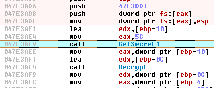
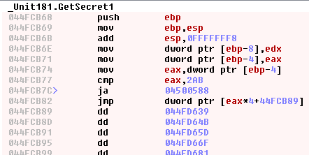
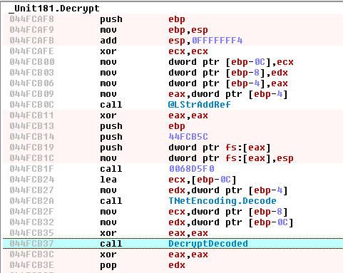
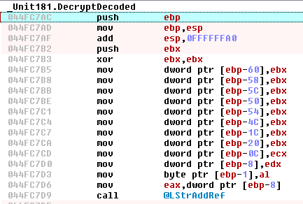

# Butcher
A binary deconstructor
## What is Butcher?
Butcher is a decompiler but also a binary deconstructor, a tool to extract useful code from compiled programs and recompile it in a new tool.
# Tutorial

## Butchering the **GetSecret** function.

Let's start with an easy example:
1. Clone this project, compile it and move to the tutorial directory:
```
git clone https://github.com/redsnk/butcher
sudo apt install build-essential
sudo apt install cmake
sudo apt-get install libcapstone-dev libjsoncpp-dev
cd butcher/
cmake CMakeLists.txt
make
cd tutorial
```
2. Unzip the sample:

> zip protected with the password "*infected*"

```
unzip -P infected libffi-6.zip
```

> *libffi-6.dll* is a malware called *Grandoreiro*, a tipical Brasilian RAT compiled with **Delphi**

If we examine this malware with [IDR](https://github.com/crypto2011/IDR) we can identify two functions used to decrypt hidden strings:



| Address  | Name | Function | Parameters |
| ------------- | ------------- | ------------- | ------------- |
| **047E3AE9** | **GetSecret1** | Retrieve encrypted string | **eax** = number of secret, **edx** = secret string  |
| **047E3AF4** | **Decrypt**    | Decrypts the string | **eax** = encrypted string, **edx** = decrypted string |

Now we are going to clone the **GetSecret1** function.

The **GetSecret1** starts at **044FCB68**:



3. Extract de **GetSecret** function from the malware:

```
../Butcher -lc -a -m -e0x40b830 "libffi-6.dll" "0x044FCB68" > secret.c
```

> -lc 
>> C source code.

> -a
>> Include the original assembler code as commented lines.

> -m
>> Load the memory from the original file.

> -e0x40b830
>> Exclude the address 0x40b830 from the analisis, this address is used to create an internal Delphi string that is no necessary in this case.

4. Modify the **main** function at **secret.c** below the "*Insert code here ...*" lines:

```
int main (int argc, char **argv) {
struct _cpu c,*cpu;

    cpu = &c;
    init(cpu);
    add_mem(cpu,0xf000,NULL,10240);
    load_mem(cpu,"libffi-6.dll",0x400,0x4458a00,0x401000,0x4459000);
    load_mem(cpu,"libffi-6.dll",0x4458e00,0x8800,0x485a000,0x9000);
    load_mem(cpu,"libffi-6.dll",0x4461600,0x22200,0x4863000,0x23000);
    load_mem(cpu,"libffi-6.dll",0x0,0x0,0x4886000,0x9e000);
    load_mem(cpu,"libffi-6.dll",0x4483800,0x4e00,0x4924000,0x5000);
    load_mem(cpu,"libffi-6.dll",0x4488600,0x6400,0x4929000,0x7000);
    load_mem(cpu,"libffi-6.dll",0x448ea00,0x600,0x4930000,0x1000);
    load_mem(cpu,"libffi-6.dll",0x448f000,0x200,0x4931000,0x1000);
    load_mem(cpu,"libffi-6.dll",0x448f200,0xb4800,0x4932000,0xb5000);
    load_mem(cpu,"libffi-6.dll",0x4543a00,0x223000,0x49e7000,0x224000);
    _rsp = 0x10400;
    _rbp = _rsp;
    /* Insert code here ... */
    if (argc > 1) {
        _eax = atoi(argv[1]);
    }
    func_0x44fcb68(cpu);
    /* Insert code here ... */
    char *str = get_unicode_ptr(cpu,_edx);
    printf("%s\n",str);
    free(str);
    end(cpu);
    return (0);
}
```

5. Compile the new tool:

```
gcc -I../src/emu/ ../src/emu/butcher_x64.c secret.c -o secret
```

6. Execute the new tool:

```
./secret 5
```

> MkIzMjk1QzMwQzRBRjkxNQ==

7. Let's try with **Python**:

> *** **Warning, this version only works with Python 3.7** ***

```
../Butcher -lp -a -m -e0x40b830 "libffi-6.dll" "0x044FCB68" > secret.py
```

> -lp
>> Python source code.

8. Modify the **main** function at **secret.py** below the "*Insert code here ...*" lines:

```
def main():
    cpu = _cpu()
    cpu.b32 = True
    cpu.add_zero_mem(0xf000,10240)
    cpu.load_mem("libffi-6.dll",0x400,0x4458a00,0x401000,0x4459000)
    cpu.load_mem("libffi-6.dll",0x4458e00,0x8800,0x485a000,0x9000)
    cpu.load_mem("libffi-6.dll",0x4461600,0x22200,0x4863000,0x23000)
    cpu.load_mem("libffi-6.dll",0x0,0x0,0x4886000,0x9e000)
    cpu.load_mem("libffi-6.dll",0x4483800,0x4e00,0x4924000,0x5000)
    cpu.load_mem("libffi-6.dll",0x4488600,0x6400,0x4929000,0x7000)
    cpu.load_mem("libffi-6.dll",0x448ea00,0x600,0x4930000,0x1000)
    cpu.load_mem("libffi-6.dll",0x448f000,0x200,0x4931000,0x1000)
    cpu.load_mem("libffi-6.dll",0x448f200,0xb4800,0x4932000,0xb5000)
    cpu.load_mem("libffi-6.dll",0x4543a00,0x223000,0x49e7000,0x224000)
    cpu._rsp = 0x10400
    cpu._rbp = cpu._rsp
    # Insert code here ...
    import sys
    if len(sys.argv) > 1:
        cpu._eax = int(sys.argv[1])
    func_0x44fcb68(cpu)
    # Insert code here ...
    str = cpu.get_unicode_ptr(cpu._edx)
    print(str)
```

9. Execute the new **Python** tool:

```
sudo pip install goto-statement
ln -s ../src/emu/butcher_x64.py .
python3 secret.py 10
```

> MkIzMjk1QzMwQzRBRjkxNQ==

## Butchering the **Decrypt** function.

Let's continue with a more complicated example.

Inside the **Decrypt** function we identify two phases, **Base64 decoding** at **044FCB2A** and **DecryptDecoded** at **044FCB37**.



10. We are going to extract the **DecryptDecoded** function:



```
../Butcher -lc -a -m -n"libffi-6.txt" "libffi-6.dll" "0x044FC7AC" > decrypt.c
```

> -n"libffi-6.txt"
>> **libffi-6.txt** it's a text list of named functions identified.

```
0x0040B440,__UStrClr
0x00435B0C,__StringReplace
0x0040B534,__LStrAddRef
0x0042D4F4,__Format
0x0040C5B0,__UStrCat
[...]
```

Now we must patch some code inside the newly generated **decrypt.c**.

11. Delphi has his own memory manager that he initializes at the start of the program, because we start directly without this initialization, we must patch this functions with the **butcher** native functions.

### __GetMem:

```
void __GetMem(struct _cpu *cpu) {
    // ---
    // _eax = size
    _eax = alloc_mem(cpu,_eax);
    return;
    // ---
    push(cpu,32,0);                                                   // 0x407124:  test        eax, eax
                                                                      // 0x407124:  test        eax, eax
    if ((s_eax&s_eax)<=0) goto label_0x40713b;                        // 0x407126:  jle     0x40713b
    func_0x405c00(cpu);                                               // 0x407128:  call        dword ptr [0x4863774]
```

### __ReallocMem:

```
void __ReallocMem(struct _cpu *cpu) {
    // _eax = _ptr_mem
    // _edx = size
    uint64_t addr = _get_dword_ptr(_eax);
    if (addr) {
        _set_dword_ptr(_eax,realloc_mem(cpu,addr,_edx));
    }
    else {
        _set_dword_ptr(_eax,alloc_mem(cpu,_edx));
    }
    return;
    //
    push(cpu,32,0);                                                   // 0x407158:  mov     ecx, dword ptr [eax]
    _ecx = _get_dword_ptr(_eax);                                      // 0x407158:  mov     ecx, dword ptr [eax]
                                                                      // 0x40715a:  test        ecx, ecx
    if ((_ecx&_ecx)==0) goto label_0x407190;                          // 0x40715c:  je      0x407190
```

### __FreeMem:

```
void __FreeMem(struct _cpu *cpu) {
    // ---
    return;
    // ---
    push(cpu,32,0);                                                   // 0x407140:  test        eax, eax
                                                                      // 0x407140:  test        eax, eax
    if ((_eax&_eax)==0) goto label_0x40714e;                          // 0x407142:  je      0x40714e
    func_0x405f84(cpu);                                               // 0x407144:  call        dword ptr [0x4863778]
                                                                      // 0x40714a:  test        eax, eax
```

12. There are also two calls to system functions that we don't need:

### CharLowerBuffW

```
void func_0x419884(struct _cpu *cpu) {
    // ---
    _esp = _esp + 8;
    return;
    // ---
    push(cpu,32,0);                                                   // 0x419884:  jmp     dword ptr [0x4924f20]
    jmp_from_iat(cpu,"user32.dll","CharLowerBuffW");                  // 0x419884:  jmp     dword ptr [0x4924f20]
}
```

### CharUpperBuffW

```
void func_0x4198b4(struct _cpu *cpu) {
    // ---
    _esp = _esp + 8;
    return;
    // ---
    push(cpu,32,0);                                                   // 0x4198b4:  jmp     dword ptr [0x4925138]
    jmp_from_iat(cpu,"user32.dll","CharUpperBuffW");                  // 0x4198b4:  jmp     dword ptr [0x4925138]
}
```

13. Also, there are three jumps that **butcher** can not understand and must be patched:

### 1)

```
    //op_r(cpu,"jmp","eax");                                            // 0x436161:    jmp     eax
    // --------------------------------------------------------------
label_0x43616a:
    _edi = pop(cpu,32);                                               // 0x43616a:  pop     edi
    _esi = pop(cpu,32);                                               // 0x43616b:  pop     esi
    _ebx = pop(cpu,32);                                               // 0x43616c:  pop     ebx
    _esp = _ebp;                                                      // 0x43616d:  mov     esp, ebp
    _ebp = pop(cpu,32);                                               // 0x43616f:  pop     ebp
    pop(cpu,32);                                                      // 0x436170:  ret     8
    _esp = _esp+0x8;                                                  // 0x436170:  ret     8
    return;
```

### 2)

```
    //op_r(cpu,"jmp","eax");                                            // 0x44fc626:   jmp     eax
    // --------------------------------------------------------------
label_0x44fc62f:
    _esp = _ebp;                                                      // 0x44fc62f: mov     esp, ebp
    _ebp = pop(cpu,32);                                               // 0x44fc631: pop     ebp
    pop(cpu,32);                                                      // 0x44fc632: ret
    return;                                                           // 0x44fc632: ret
```

### 3)

```
    //op_r(cpu,"jmp","eax");                                            // 0x44fcac0: jmp     eax
    // --------------------------------------------------------------
label_0x44fcac9:
    _ebx = pop(cpu,32);                                               // 0x44fcac9: pop     ebx
    _esp = _ebp;                                                      // 0x44fcaca: mov     esp, ebp
    _ebp = pop(cpu,32);                                               // 0x44fcacc: pop     ebp
    pop(cpu,32);                                                      // 0x44fcacd: ret
    return;                                                           // 0x44fcacd: ret
```

14. Finally, we must patch de **main** function. Delphy strings have a 8 bytes header (4 bytes counter + 4 bytes length):

```
int main (int argc, char **argv) {
struct _cpu c,*cpu;

    cpu = &c;
    init(cpu);
    add_mem(cpu,0xf000,NULL,10240);
    load_mem(cpu,"libffi-6.dll",0x400,0x4458a00,0x401000,0x4459000);
    load_mem(cpu,"libffi-6.dll",0x4458e00,0x8800,0x485a000,0x9000);
    load_mem(cpu,"libffi-6.dll",0x4461600,0x22200,0x4863000,0x23000);
    load_mem(cpu,"libffi-6.dll",0x0,0x0,0x4886000,0x9e000);
    load_mem(cpu,"libffi-6.dll",0x4483800,0x4e00,0x4924000,0x5000);
    load_mem(cpu,"libffi-6.dll",0x4488600,0x6400,0x4929000,0x7000);
    load_mem(cpu,"libffi-6.dll",0x448ea00,0x600,0x4930000,0x1000);
    load_mem(cpu,"libffi-6.dll",0x448f000,0x200,0x4931000,0x1000);
    load_mem(cpu,"libffi-6.dll",0x448f200,0xb4800,0x4932000,0xb5000);
    load_mem(cpu,"libffi-6.dll",0x4543a00,0x223000,0x49e7000,0x224000);
    _rsp = 0x10400;
    _rbp = _rsp;
    /* Insert code here ... */
    _esp += 0xfffffff4;
    char *secret = argv[1];
    _edx = alloc_mem(cpu,8+strlen(secret)*2);
    _set_dword_ptr(_edx,0xffffffff);
    _set_dword_ptr(_edx+4,strlen(secret));
    set_unicode_ptr(cpu,_edx+8,secret);
    _ecx = _ebp-0x0c;
    _edx += 8;
    _eax = 0;
    func_0x44fc7ac(cpu);
    /* Insert code here ... */
    uint64_t tmp = _get_dword_ptr(_ebp-0x0c);
    char *str = get_unicode_ptr(cpu,tmp);
    printf("%s\n",str);
    free(str);
    end(cpu);
    return (0);
}
```

15. Compile the new tool:

```
gcc -I../src/emu/ ../src/emu/butcher_x64.c decrypt.c -o decrypt
```

16. Execute the decryptor:

```
./secret 5 | base64 -d
```

> C74C9833A13BE413

```
./decrypt C74C9833A13BE413
```

> Banamex

16. At the end, join all together in the script **tool.sh**:

```
#!/bin/bash

secret=$(./secret $1 | base64 -d)
./decrypt $secret
```

16. And execute:

```
./tool.sh 5
Inbursa
./tool.sh 6
Bajionet
./tool.sh 7
BanCoppel
```
